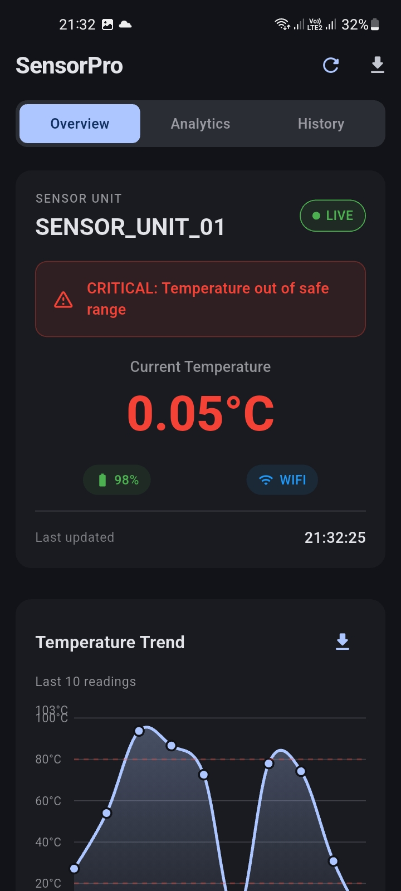
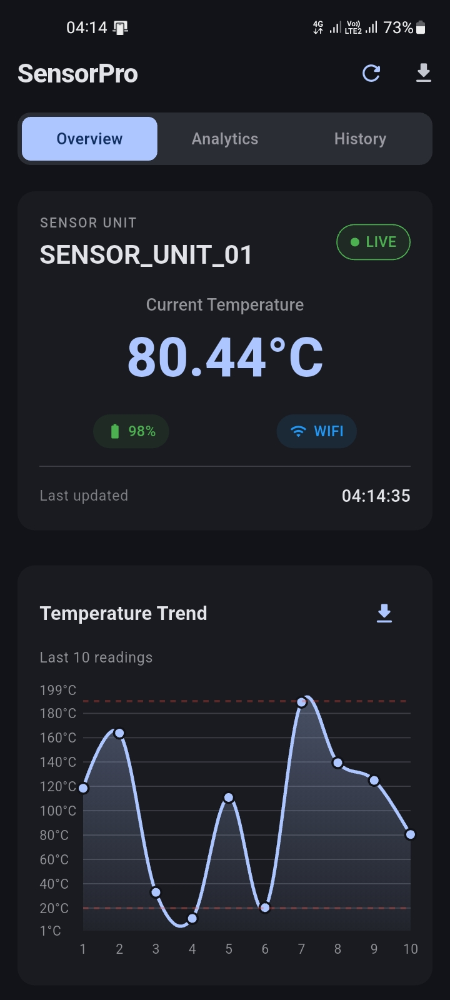
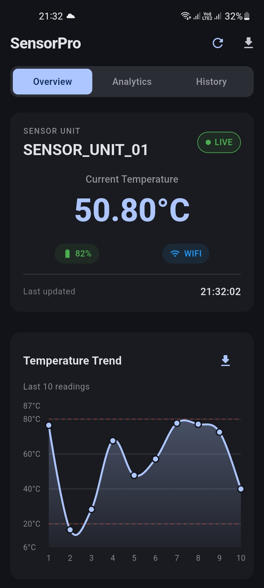
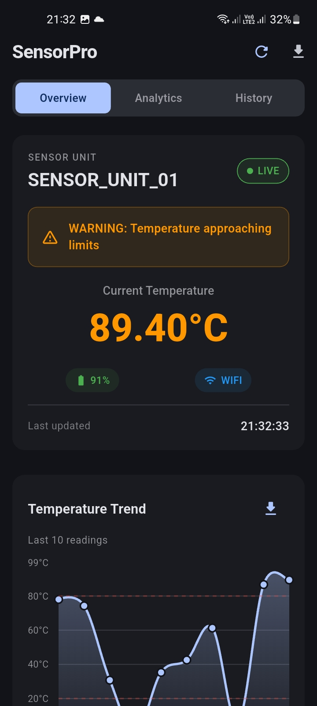

# SensorPro Analytics - IoT Sensor Dashboard 📱


<div align="center">
    <a href="https://drive.google.com/file/d/1UfC-31qQ6ATB8TT1p1143dCfFqJUoLY5/view?usp=sharing" target="_blank">
        
        <h3>📲 Download APK</h3><p>for android</p><p><em>Latest stable version: v1.0.0</em></p>
    </a>
    <a href="https://youtube.com/shorts/sFtr-V5pqxw?si=mlXdDVHiY_KYcK5M" target="_blank">Check this out,</a> How to get this app Quickly on Android <br>
</div>

A professional Flutter mobile application for real-time IoT sensor monitoring with Firebase integration, featuring live data visualization, analytics, and alert systems.

<div align="center">
    
    
    
    
</div>

## ✨ Features

| Feature | Description |
|---------|-------------|
| 📊 **Real-time Monitoring** | Live updates from IoT sensors via Firebase Realtime Database |
| 📈 **Visual Analytics** | Interactive charts showing temperature trends using fl_chart |
| 🚨 **Smart Alerts** | Color-coded warnings for critical temperature ranges |
| 🔋 **Battery & Connection** | Real-time status indicators for device health |
| 💾 **Data Export** | CSV export functionality for data analysis |
| 📱 **Responsive Design** | Adapts to different screen sizes and orientations |
| 🌓 **Theme Support** | Full dark/light theme support for better UX |

## 🛠️ Technology Stack

- **Framework**: Flutter 3.0+
- **Backend**: Firebase Realtime Database
- **Charts**: fl_chart for data visualization
- **File Handling**: CSV export with share functionality
- **Platform**: Android & iOS compatible
- **State Management**: Provider/Riverpod (specify which one you use)

## 🚀 Quick Start

### Prerequisites

1. **Flutter SDK (3.0 or higher)**
   ```bash
   flutter doctor
2. **Firebase Account (for database setup)**
3. **Android Studio / VS Code with Flutter plugins**

### Installation

1. **Clone the repository**
    ```bash
   git clone git@github.com:JanithSheshan/sensor_monitor_app.git
    cd sensor_monitor_app
2. **Install dependencies**
    ```bash
   flutter pub get
3. **Configure Firebase**
- **Create a new Firebase project at** console.firebase.google.com
- **Add Android/iOS app to your Firebase project**
- **Download configuration files:**
  - **Android:** google-services.json
  - **iOS:** GoogleService-Info.plist
- **Place files in appropriate directories**

4. **Update Firebase Configuration in** lib/main.dart:
    ```bash
   await Firebase.initializeApp(
        options: const FirebaseOptions(
        apiKey: "YOUR_API_KEY",
        appId: "YOUR_APP_ID",
        messagingSenderId: "YOUR_SENDER_ID",
        projectId: "YOUR_PROJECT_ID",
        databaseURL: "YOUR_DATABASE_URL",
        ),
    );

5. **Run the application**
    ```bash
   flutter run
   
## 📡 ESP32 Setup

### Hardware Requirements

- **ESP32 Development Board**
- **WiFi network access**

### ESP32 Code Configuration

1. **Update WiFi credentials:**
    ```bash
   #define WIFI_SSID "YOUR_WIFI_SSID"
    #define WIFI_PASSWORD "YOUR_WIFI_PASSWORD"
   
2. **Update Firebase credentials:**
    ```bash
   #define FIREBASE_HOST "YOUR_FIREBASE_DATABASE_URL"
    #define FIREBASE_AUTH "YOUR_FIREBASE_DATABASE_SECRET"
   
3. **Upload code using Arduino IDE or PlatformIO**

### Sensor Data Format

- **The application expects data in this JSON format:**
    ```bash
    {
        "sensor_id": "SENSOR_UNIT_01",
        "status": "active",
        "readings": [25.5, 26.1, 25.8, 26.3, 25.9],
        "metadata": {
        "battery_level": 92,
        "connection_type": "WiFi",
        "timestamp": "2024-01-15T10:30:00Z"
        }
    }

## 🎮 Application Usage

### Dashboard Tabs

| Tab | Description                                                |
|-----|------------------------------------------------------------|
| 📊 **Overview** | Main dashboard with current readings and status indicators |
| 📈 **Analytics** | Detailed charts and performance metrics (pending)          |
| 🚨 **History** | Complete log of all sensor readings with filtering         |

### Alert System

| Status | Temperature Range | Indicator  |
|--------|-------------------|------------|
| Normal	| 20°C - 80°C       | 🔵 Blue    |
| Warning	| >10°C or <80°C    | 	🟠 Orange |
| Critical | <10°C or >90°C	   | 🔴 Red     |


### Data Export
1. **Tap the download icon (📥) on the History tab**
2. **CSV file will be generated and available for sharing**

## 🔧 Project Structure

    
    sensor_monitor_app/
    ├── lib/
    │   └── main.dart                 # Application entry point
    ├── esp32_code/
    │   └── sensor_esp32.ino          # ESP32 sensor code
    ├── assets/                       # Images, fonts, etc.
    ├── android/                      # Android specific files
    ├── ios/                          # iOS specific files
    └── test/                         # Test files


## 🧠 AI-Assisted Development

### Development Process

This project utilized AI assistance in the following areas:

- **Code Generation:** Initial boilerplate code and Firebase integration
- **UI/UX Design:** Layout suggestions and responsive design patterns
- **Error Handling:** Best practices for network and data processing
- **Documentation:** README structure and code comments

### Human Oversight

All AI-generated code was:

- **✅ Reviewed for correctness and efficiency**
- **✅ Tested with various edge cases**
- **✅ Integrated with manual code where necessary**
- **✅ Validated against Flutter best practices**

## 📊 Data Flow Architecture
   
    graph LR
        A[ESP32 Sensor] --> B[Firebase Realtime Database]
        B --> C[Flutter Application]
        C --> D[Real-time Visualization]
        C --> E[Alert]
        C --> F[CSV Export]
        B --> G[Historical Data Storage]

## 📈 Future Enhancements
- **Multi-sensor support with device grouping**
- **User authentication system (Firebase Auth)**
- **Push notifications for critical alerts**
- **Cloud storage for historical data backup**
- **Predictive analytics using ML models**
- **Offline data synchronization**
- **Custom alert thresholds per sensor**

Last Updated: January 2024

Note: This application is designed for educational purposes and demonstration of IoT integration capabilities. For production use, additional security measures and error handling should be implemented.
